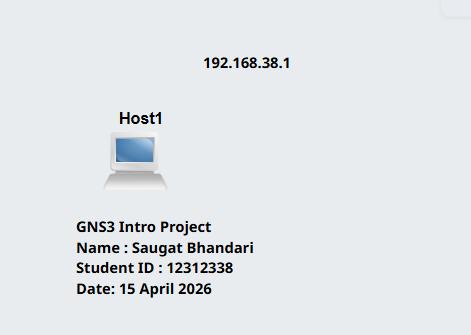
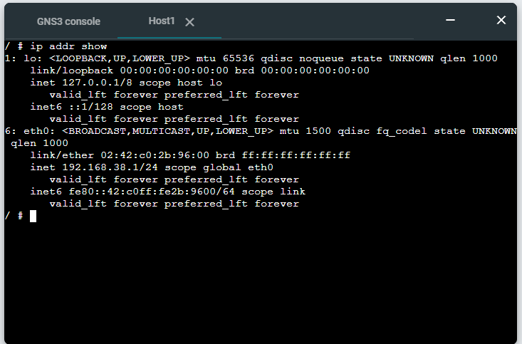

# Week 01 – COIT20261 Portfolio

## Week 01 Tutorial Tasks Completed

### Unit Setup

* Reviewed unit profile and assessment requirements.
* Confirmed required software installation:

  * VirtualBox
  * GNS3

### GitHub Repository

* Created private repository named:
  **12312338-COIT20261-2026T1**
* Shared repository access with tutor.
* Created Week 01 portfolio file (`week1.md`).

### Markdown

* Used Markdown for documentation and portfolio formatting in GitHub.

---

## Task 1 – GNS3 Basics

### Project Details

* Project name: **GNS3-Intro-12312338**
* Added: **1 Linux Host node**
* Added annotations:

  * Project title
  * Name
  * Student ID
  * Date
  * IP address

### Network Configuration

Configured static IP address in:

```
/etc/network/interfaces
```

Configuration used:

```
auto eth0
iface eth0 inet static
   address 192.168.38.1
   netmask 255.255.255.0
   up sysctl net.ipv4.ip_forward=0
```

Command used to verify IP address:

```
ip addr show
```

---

## Required Outputs

* Exported project file:
  `GNS3-Intro-12312338.gns3project`   
  

* Screenshot of network topology:
  `GNS3-Intro-12312338-network.png`   
  

* Screenshot of console showing IP address:
  `GNS3-Intro-12312338-ipaddress.png`   
  

---

## Notes / Important Details

* Static IP must be configured **before starting the node**.
* Interface configured: **eth0**
* Default gateway not required for this task.
* IP forwarding disabled using:

  ```
  net.ipv4.ip_forward=0
  ```

---
