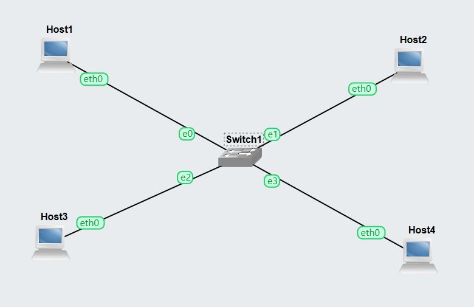
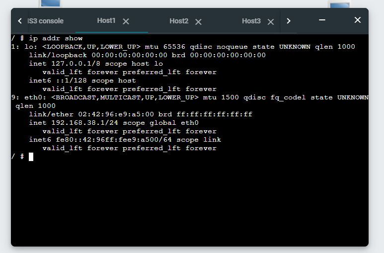
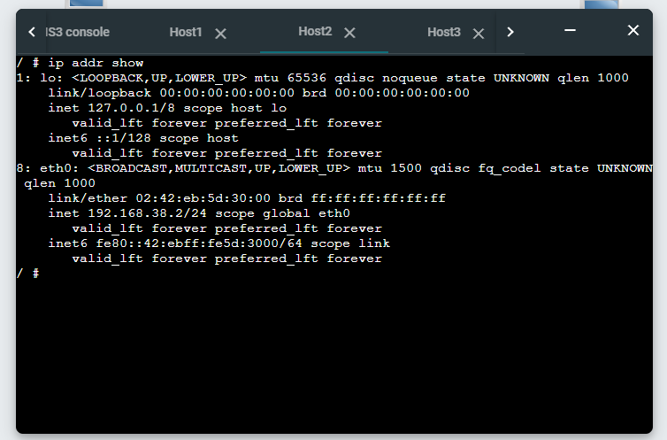
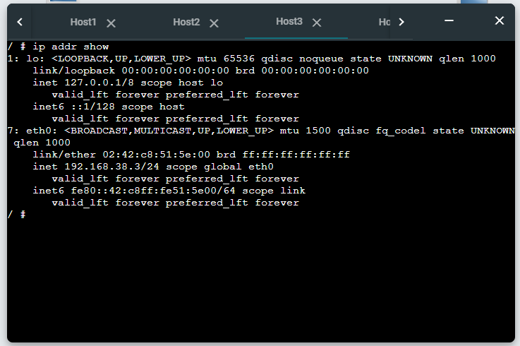
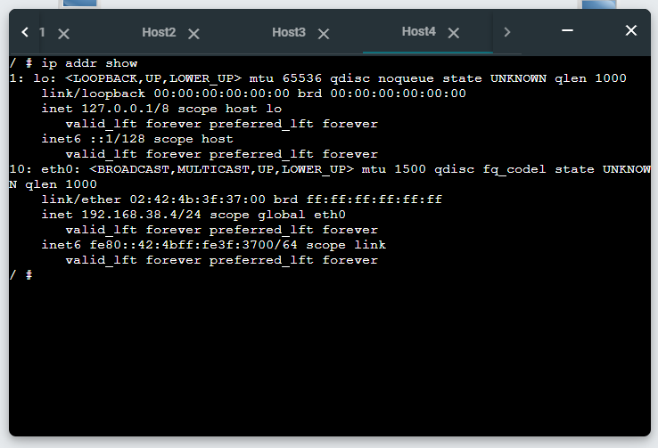
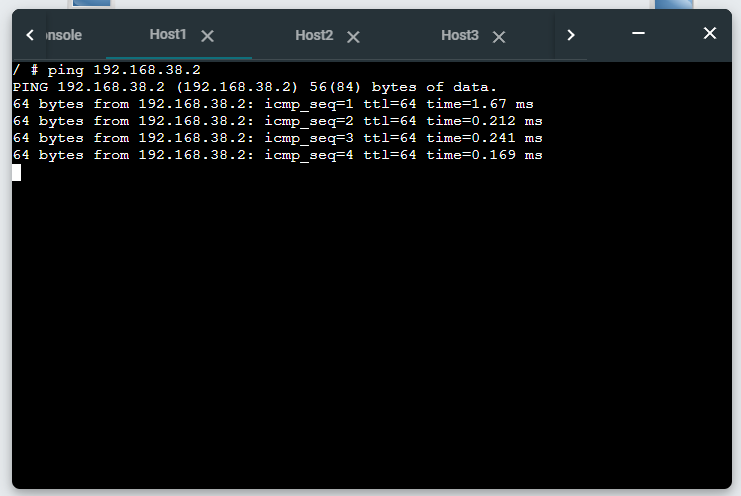
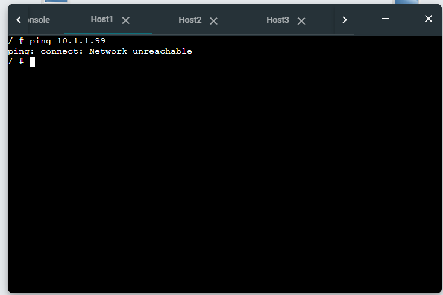
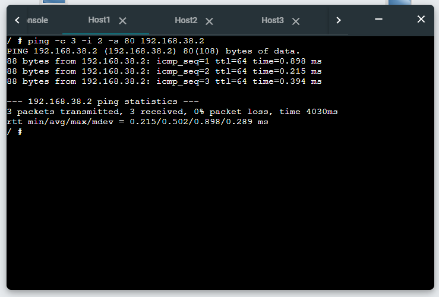

# Week 02 – COIT20261 Portfolio

## Student Information

* **Name:** Saugat Bhandari
* **Student ID:** 12312338
* **Project Name:** Setting-IP-12312338

---

## Task 1 – Setting Static IP Addresses

### Project Setup

* Created project: **Setting-IP-12312338**
* Added:

  * 4 × Linux Host nodes
  * 1 × Ethernet switch
* Connected all hosts into a LAN.

### Static IP Configuration Methods

#### Method 1 & 2 – Using GNS3 Configure Menu

* Set static IP addresses for **Host A** and **Host B** using the GNS3 configuration interface.

#### Method 3 – Editing `/etc/network/interfaces`

Command used:

```bash
nano /etc/network/interfaces
```

Configuration:

```bash
auto eth0
iface eth0 inet static
   address 192.168.38.3
   netmask 255.255.255.0
```

Reloaded network:

```bash
ifdown eth0
ifup eth0
```

#### Method 4 – Using `ip` Command

```bash
ip address add 192.168.38.4/24 dev eth0
```

Verification command:

```bash
ip address show
```

---

## Task 1 – Evidence

### Network Topology



### Host IP Address Verification









### Exported Project

* `Setting-IP-12312338.gns3project`
  [Project File](./images/Setting-IP-12312338.gns3project)

---

## Task 2 – Testing Network Connectivity with Ping

### Basic Ping Test

```bash
ping 192.168.38.2
```

Stopped using:

```bash
Ctrl + C
```

Observed:

* Successful responses received
* RTT values displayed

---

### Ping to Invalid IP Address

```bash
ping 10.1.1.99
```

Observed:

* No response
* Packet loss

---

### Ping with Options

```bash
ping -c 3 -i 2 -s 80 192.168.38.2
```

Options used:

* `-c` → limit number of packets
* `-i` → interval
* `-s` → packet size

---

## Task 2 – Evidence

### Ping Without Options



### Ping to Wrong IP Address



### Ping with Options



---

## Key Technical Notes

* Static IP methods used:

  1. GNS3 Configure menu
  2. `/etc/network/interfaces`
  3. `ip address add`
* `ip address add` → **temporary**
* `/etc/network/interfaces` → **persistent**
* `ifdown` and `ifup` required after editing interfaces file
* Ping used to verify connectivity and measure RTT

---
