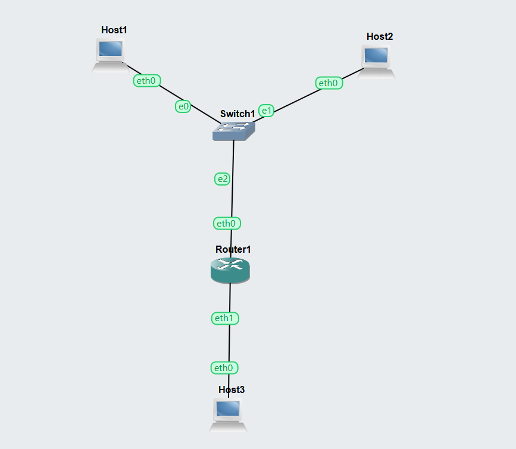
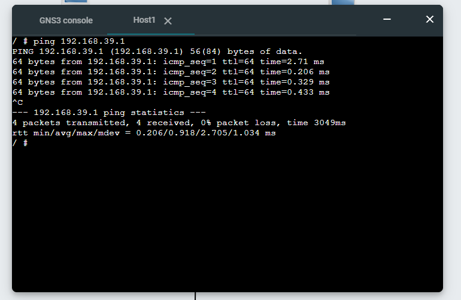
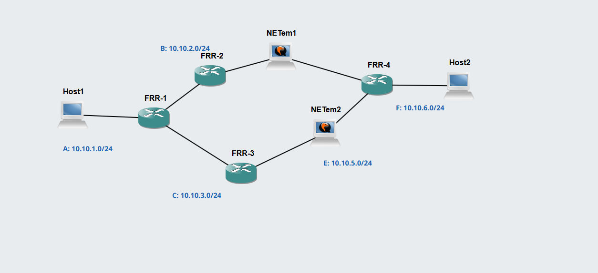
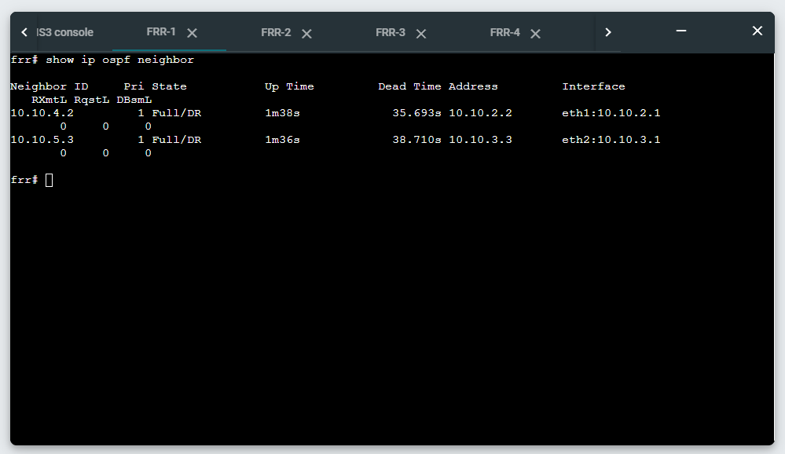
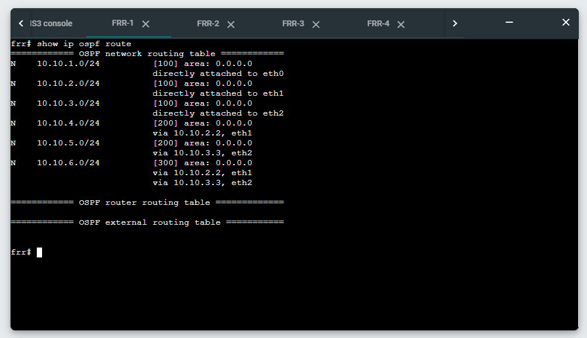
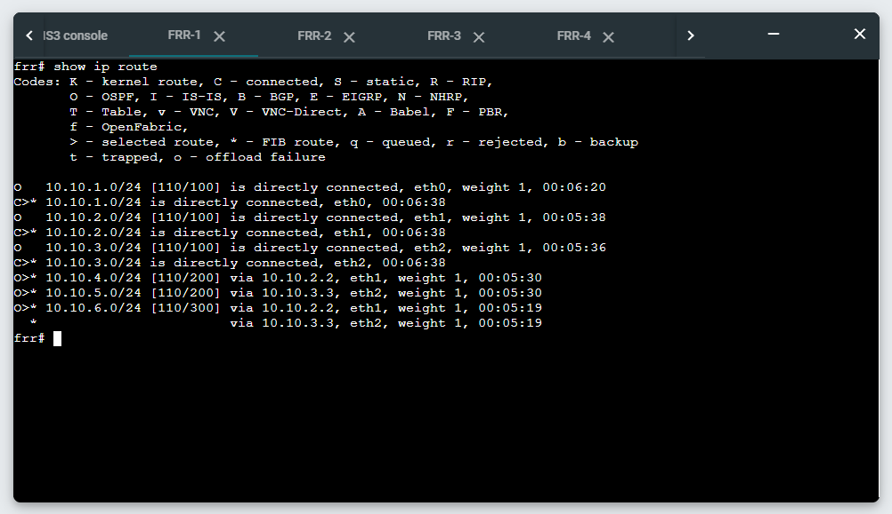
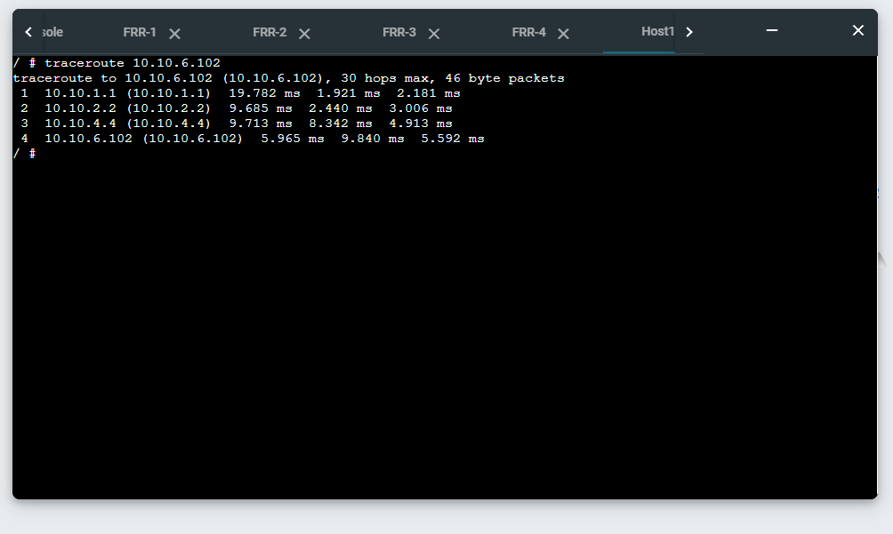
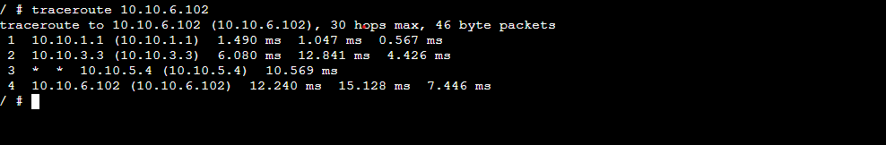

# Week 04 – COIT20261 Portfolio

## Student Information

* **Name:** Saugat Bhandari
* **Student ID:** 12312338

---

# Task 1 – View Routing Tables

## Project Setup

* Project name: **View-Routes-12312338**
* Added:

  * 3 × Linux Host nodes
  * 1 × Linux Router
  * 1 × Ethernet switch
* Created **two subnets** connected via router.
* Assigned static IP addresses to all hosts and router interfaces.

Example subnet usage:

* Subnet 1: **192.168.38.0/24**
* Subnet 2: **192.168.39.0/24**

---

## Forwarding Configuration

### Router (Forwarding Enabled)

```bash
up sysctl net.ipv4.ip_forward=1
```

### Hosts (Forwarding Disabled)

```bash
up sysctl net.ipv4.ip_forward=0
```

### Check Forwarding Status

```bash
sysctl net.ipv4.ip_forward
```

---

## View Routing Table

Command used on each device:

```bash
ip route show
```

---

## Network Testing

Ping test performed between hosts on different subnets.

```bash
ping 192.168.39.1
```

---

## Task 1 – Evidence

### Network Topology



### Ping Between Subnets



### Exported Project

* `View-Routes-12312338.gns3project`

---

# Task 2 – Dynamic Routing with OSPF

## Project Setup

* Imported template project:
  **OSPF-Basics-Template.gns3project**
* Duplicated project as:
  **OSPF-Basics-12312338.gns3project**
* Started all FRR router nodes and waited for `frr#` prompt.

---

## FRR Routing Commands

### Enter FRR Shell

```bash
vtysh
```

### View Neighbor Routers

```bash
show ip ospf neighbor
```

### View OSPF Routes

```bash
show ip ospf route
```

### View Routing Table

```bash
show ip route
```

---

## Path Testing

### Check Network Path

```bash
traceroute 10.0.0.2
```

### Test Link Failure

* Stopped one **NETem** node to simulate link failure.
* Ran traceroute again to observe new routing path.

---

## Task 2 – Evidence

### OSPF Network Topology



### Neighbor Routers Output




### Routing Table Output



### Traceroute Before Link Failure



### Traceroute After Link Failure



### Exported Project

* `OSPF-Basics-12312338.gns3project`

---

## Key Technical Notes

* Router forwards packets between subnets.
* Hosts should have forwarding disabled.
* Routing tables viewed using:

  ```
  ip route show
  ```
* OSPF automatically updates routes when network changes.
* `traceroute` shows the path packets take through routers.

---
