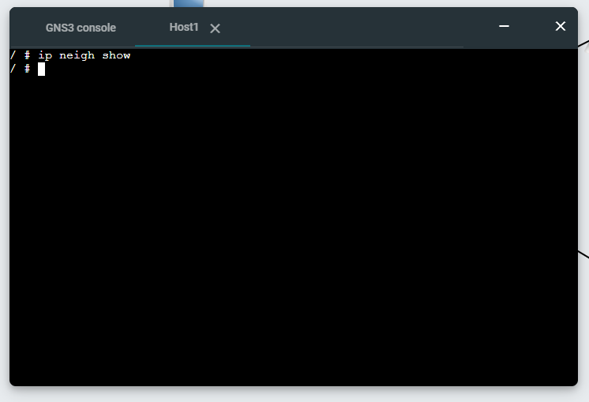
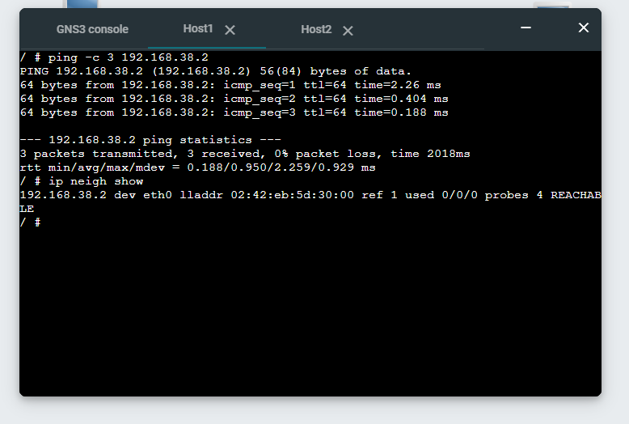
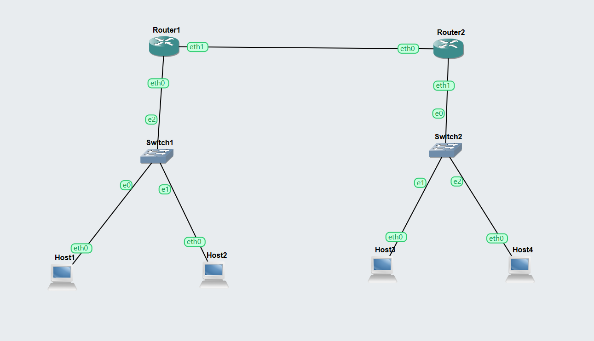
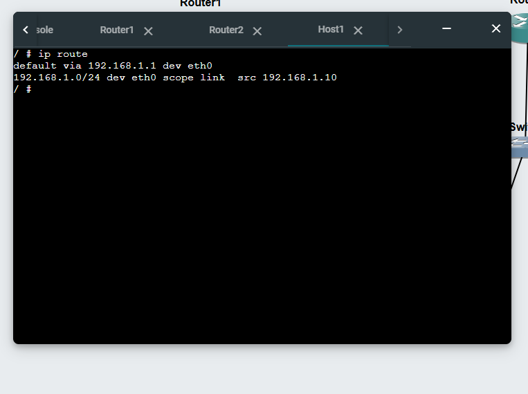
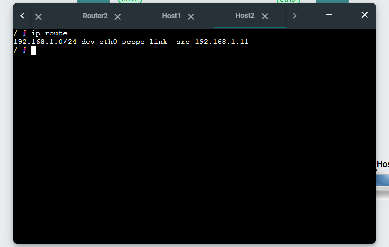
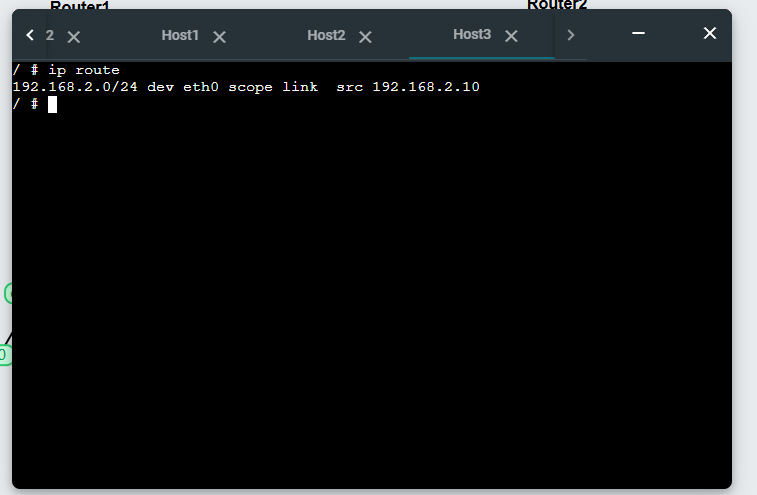
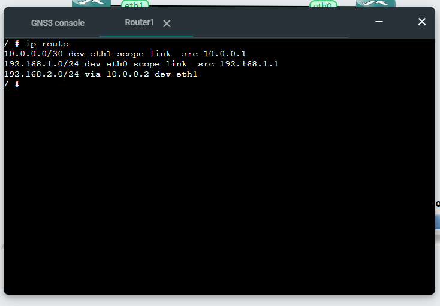
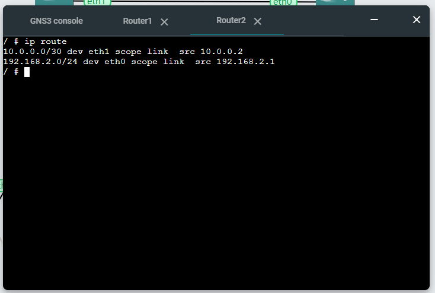
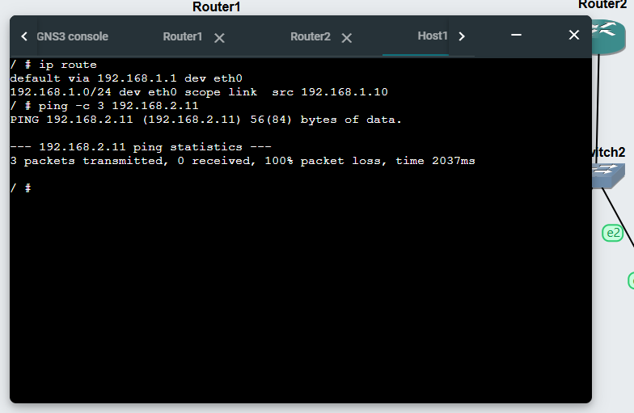

## Student Information  

* **Name:** Saugat Bhandari  
* **Student ID:** 12312338  

---

# Task 1 – Resolving IP Addresses to Hardware Addresses (ARP)  

## Project Setup  

* Project name: **Setting-IP-12312338**  
* Used existing project with:  
  * 4 × Linux Host nodes  
  * 1 × Ethernet switch  
* Hosts referred to as:  
  * Host A  
  * Host B  
  * Host C  
  * Host D  
* All hosts configured within the same subnet.  

### Example IP Configuration  

* Subnet: **192.168.60.0/24**  
* Host A: 192.168.60.1  
* Host B: 192.168.60.2  
* Host C: 192.168.60.3  
* Host D: 192.168.60.4  

---

## View Initial ARP Table  

Command used on Host A:  

```bash
ip neigh show
````

* Initially, ARP table contained few or no entries.

---

## ARP Learning – Ping Test

### Step 1: Ping from Host A to Host B

```bash
ping 192.168.60.2
```

### Step 2: View ARP Table Again

```bash
ip neigh show
```

* A new entry appeared mapping:

  * IP address of Host B → MAC address
* Entry state observed as **REACHABLE**

---

## Additional ARP Activity

### Ping from Host C to Host A

```bash
ping 192.168.60.1
```

### View ARP Table on Host A

```bash
ip neigh show
```

* Additional entry created for Host C
* ARP table updated dynamically as communication occurred

---

## Task 1 – Evidence

### ARP Table before Communications



### ARP Table After Multiple Communications



---

# Task 2 – Default Gateways and Routing

## Project Setup

* Project name: **Default-Gateway-12312338**
* Added:

  * 4 × Linux Host nodes
  * 2 × Linux Router nodes
  * 2 × Ethernet switches
* Network consists of **3 subnets**:

  * Subnet 1: Hosts + Router 1
  * Subnet 2: Hosts + Router 2
  * Subnet 3: Connection between routers

---

## Network Design

### Subnet 1

* Network: **192.168.1.0/24**
* Host1: 192.168.1.10
* Host2: 192.168.1.11
* Router1: 192.168.10.1

### Subnet 2

* Network: **192.168.2.0/24**
* Host3: 192.168.2.10
* Host4: 192.168.2.11
* Router2: 192.168.20.1

### Subnet 3 (Router Link)

* Network: **10.0.0.0/24**
* Router1: 10.0.0.1
* Router2: 10.0.0.2

---

## Host Configuration (/etc/network/interfaces)

Example:

```bash
auto eth0
iface eth0 inet static
  address 192.168.10.2
  netmask 255.255.255.0
  gateway 192.168.10.1
  up sysctl net.ipv4.ip_forward=0
```

---

## Router Configuration

### Enable Forwarding

```bash
up sysctl net.ipv4.ip_forward=1
```

---

## Routing Tables

Command used on all devices:

```bash
ip route show
```

* Hosts use default gateway to reach other networks
* Routers contain routes for all connected subnets

---

## Connectivity Testing

### Ping Between Subnets

```bash
ping 192.168.2.11
```

* Successful communication confirmed between hosts on different subnets

---

## Observations

* Default gateway allows hosts to communicate outside their subnet.
* Routers forward packets between networks.
* Without gateway configuration, inter-subnet communication fails.
* Routing tables determine packet forwarding paths.

---

## Task 2 – Evidence

### Network Topology



### Routing Table Output








### Ping   
    

### Exported Project

* `Default-Gateway-12312338.gns3project`
  [Project File](./images/Default-Gateway-12312338.gns3project)
